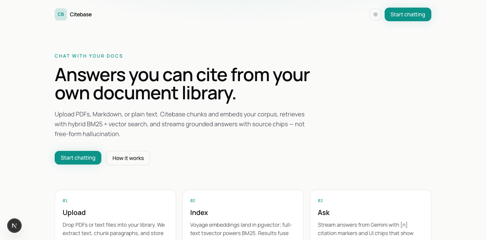
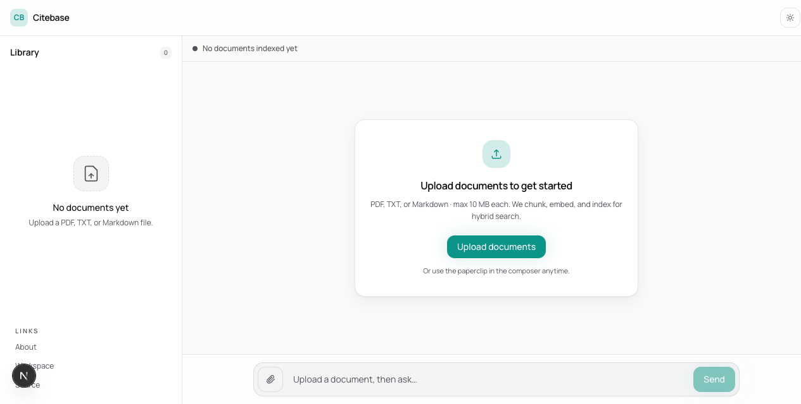
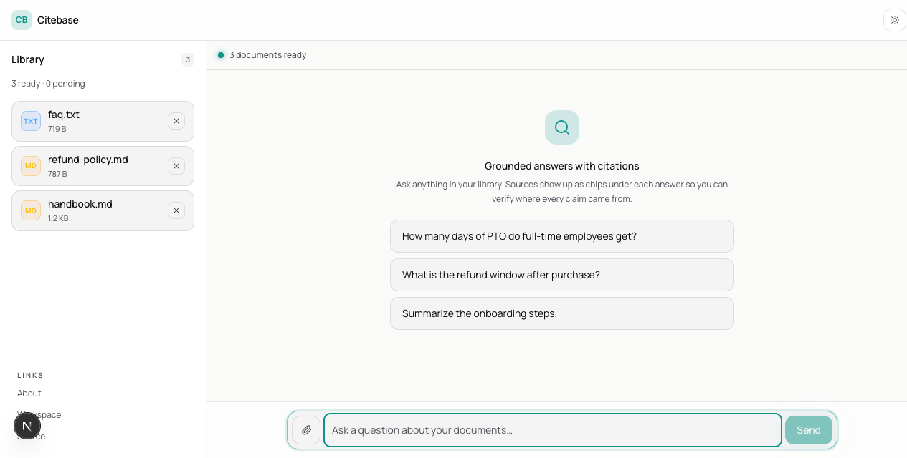
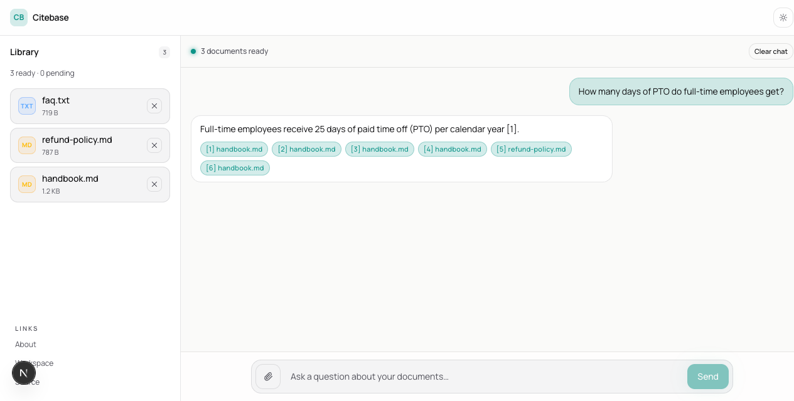

# Citebase

**Chat with your docs** — upload PDF / TXT / MD, index with hybrid retrieval, ask questions, get answers with citations.

This is a fullstack interview assignment (Option 1: classic RAG). Built as a small, intentional greenfield app so reviewers can clone, run, and read the code without a multi-product monorepo.

**Live demo:** [citebase-dun.vercel.app](https://citebase-dun.vercel.app/)

---

## a. Quick setup

### Prerequisites

- Node.js 20+
- Docker (for local Postgres + pgvector)
- A [Vercel AI Gateway](https://vercel.com/docs/ai-gateway) API key with access to:
  - `google/gemini-2.5-flash` (chat)
  - `voyage/voyage-4-lite` (embeddings, 1024-d)

### Install & run

```bash
git clone https://github.com/dineufeld/citebase.git
cd citebase
npm install

cp .env.example .env.local
# edit .env.local — set AI_GATEWAY_API_KEY (and DATABASE_URL if not using local Docker)

npm run db:up          # Postgres+pgvector on localhost:5433
npm run db:setup       # apply schema + seed default collection
npm run dev            # http://localhost:3001
```

Open **http://localhost:3001/**, upload files from `fixtures/`, ask e.g. “How many PTO days do employees get?”

### Screenshots










### Useful scripts

| Script | Purpose |
|---|---|
| `npm run typecheck` | `tsc --noEmit` |
| `npm test` | `vitest run` — 35 pure unit tests (chunk, fusion, prompts, MIME detection, upload validation) |
| `npm run check:chunker` | pure unit assertions (chunk + RRF) |
| `npm run smoke:rag` | DB health + hybrid probe + golden/delete/refuse integration probes |
| `npm run db:down` | stop local Postgres |

### Demo questions (with fixtures)

1. “How many days of PTO do full-time employees get?”
2. “What is the refund window after purchase?”
3. “Which embedding model does Citebase use?” (from `faq.txt`)
4. “What is our CEO’s favorite color?” → should refuse / not invent from corpus

### Theme

Default theme is **light**. Toggle to **black** via the sun/moon button in the
header (available on `/`, `/app`, and `/about`). Preference is stored in
`localStorage.cb-theme` (`'dark'` or absent). On first visit, the app honors
`prefers-color-scheme: dark` so dark-mode OS users see the dark theme without
a flash.

---

## b. Architecture overview

```
Browser (/app)
  │
  ├─ POST /api/documents   → save file → extract → chunk → embed → pgvector + tsvector
  ├─ GET  /api/documents   → list library + status
  ├─ DELETE /api/documents/[id]
  └─ POST /api/chat        → hybridSearch → streamText (Gemini) + data-sources citations

Postgres (pgvector)
  collections → documents → chunks(embedding vector(1024), search_vector tsvector)
```

**Ingest path:** multipart upload → local `storage/{id}/` in development or private Vercel Blob in production → `pdfjs-dist` (PDF) or UTF-8 text (TXT/MD) → paragraph chunker → Voyage embeddings via AI Gateway → insert chunks → `to_tsvector` for BM25.

**Query path:** last user message → embed query → BM25 ∥ vector (timeouts) → RRF fuse → top 6 passages into system prompt → stream UI message protocol → client renders citation chips from `data-sources` part.

```
                 ┌──────────┐
 user question → │ embed q  │──► vector ANN (cosine)
                 └────┬─────┘
                      │
                 ┌────▼─────┐     ┌─────────┐
                 │  BM25    │────►│   RRF   │──► top-k context
                 └──────────┘     └────┬────┘
                                       ▼
                                  Gemini stream
                                  + citation chips
```

---

## c. What would be required to productionize (AWS / GCP / Azure / Cloudflare)

| Concern | MVP (now) | Production |
|---|---|---|
| File storage | Local `storage/` or private Vercel Blob | S3 / GCS / Azure Blob / R2 + virus scan |
| Ingest | Sync in request (`maxDuration` 60s) | Queue (SQS / Pub/Sub / Cloudflare Queues) + workers; retry + DLQ |
| Database | Single Docker/Neon Postgres | Managed Postgres with pgvector, connection pooler (PgBouncer), read replicas for search if needed |
| Auth / tenancy | None (single default collection) | Auth.js/Clerk + per-user `collection_id` RLS |
| API edge | Next.js on one machine | Vercel/Cloud Run/ACS + rate limits (WAF / API Gateway) |
| Observability | `console.log` latency/mode | OpenTelemetry traces; Langfuse/Helicone for LLM; `search_logs` table |
| Scale retrieval | HNSW + GIN on one DB | Partition by tenant; optional re-ranker (Cohere/Voyage rerank); cache frequent queries |
| Compliance | N/A | Encryption at rest, retention policies, PII redaction in logs |
| HA | Single compose | Multi-AZ DB, multi-instance workers, blue/green deploys |

Hyper-scaler sketch: **Cloudflare R2** (files) + **Neon/Aurora pgvector** (index) + **Vercel** (Next.js) + **Inngest/SQS worker** (ingest) is enough for an early SaaS.

---

## d. RAG / LLM approach & decisions

### Choices considered → final

| Layer | Considered | Chose | Why |
|---|---|---|---|
| LLM | GPT-4.1-mini, Claude Haiku, Gemini Flash | **Gemini 2.5 Flash via AI Gateway** | Strong quality/latency/cost; one billing path |
| Embeddings | OpenAI text-embedding-3-small, Voyage | **voyage/voyage-4-lite @ 1024** | Good retrieval quality; matches dimensions I already trust in production systems |
| Vector DB | Pinecone, Qdrant, pgvector | **pgvector in Postgres** | Joins with `documents` for filenames; one ops surface; HNSW |
| Orchestration | LangChain / LlamaIndex | **Thin TypeScript modules** | Debuggable, no magic graphs for a small app |
| Retrieval | Vector-only, multi-query | **Hybrid BM25 + vector + RRF** | Lexical exactness (IDs, policy numbers) + semantic paraphrase |
| Chunking | Fixed 512 tokens | **Paragraph merge ~400 chars + ~100 overlap + context window** | Preserves topical units; context_window available if we widen prompts later |

### Prompt & context management

- Cap **6** fused chunks in the system prompt.
- Numbered passages `[1] file=…` so the model can cite consistently.
- Empty-retrieval branch: dedicated system prompt that forbids inventing corpus facts.
- Temperature **0.2** for factual tone.

### Guardrails

- MIME / extension allowlist; **10 MB** max.
- Treat document text as **untrusted data** (not instructions) — prompt says to answer from passages only.
- No tools that can exfiltrate env or browse the network.
- Clear error states when ingest fails (e.g. scanned PDF with no text).

### Quality

- Fixture Q&A manual checklist.
- `npm run check:chunker` for pure fusion/chunk invariants.
- Next step I’d add: a 20-question golden set with citation hit-rate metrics.

### Observability

- Per-request log: `mode`, chunk count, BM25/vector counts, latency.
- Production: persist `search_logs` (query embedding, result ids, timings).

---

## e. Key technical decisions

1. **Greenfield, not a fork of a multi-host product** — reviewers get a readable repo.
2. **Sync ingest for MVP** — simplest demo path; documented as the first production debt.
3. **Filesystem locally, private Vercel Blob when deployed** — no cloud credentials required for local demo while production uploads persist across serverless invocations.
4. **Single default collection** — schema supports more; UI doesn’t.
5. **AI Gateway only** — no direct Google/Voyage keys in the app.
6. **Custom `data-sources` UI stream part** for citation chips without parsing model prose.

---

## f. Engineering standards (and what I skipped)

**Followed**

- TypeScript strict
- Small modules by concern (`ingest/`, `retrieval/`, `ai/`)
- Conventional commit style if extended
- Env example; secrets gitignored
- Capability language on the landing page (no fake accuracy claims)
- No italic UI styling (legibility)

**Skipped (intentionally, time-boxed)**

- Multi-user auth & RLS
- Full CI matrix / load tests
- OCR for scanned PDFs
- Re-ranker stage
- Eval harness in CI
- Dockerized app image (only DB is compose’d)

---

## g. How I used AI coding tools

I build with AI agents daily (scaffolding, refactors, UI polish, type-error sweeps). For this assignment I treated them the same way I do on production work: **fast on the boring path, slow on the load-bearing path.**

What I let the assistant draft freely:
- Next.js / Tailwind boilerplate, layout chrome, theme toggle wiring
- README skeleton and package scripts
- Mechanical “make the typechecker happy” fixes after API shape changes

What I did **not** outsource blindly:
- **Retrieval design** — hybrid BM25 + vector + RRF, timeouts, and BM25 fallback come from patterns I’ve already run in production (website RAG / chatbot indexing), not from a LangChain tutorial dump
- **Ingest failure modes** — empty PDF text, zero embeddings, status `failed` vs silent success
- **Prompt + refuse path** — empty library must not invent handbook facts; I verified that live
- **What ships in the repo** — no secrets, no private monorepo code, no “five-host” complexity reviewers can’t run

**Do’s for me**
- Start from a working vertical slice (upload → index → one good answer) before UI polish
- Re-read every retrieval / prompt / env boundary myself before calling it done
- Prefer thin TypeScript modules I can debug at 2am over a framework graph I can’t

**Don’ts**
- Don’t paste an orchestration framework I wouldn’t maintain
- Don’t accept a “green typecheck” as product-complete — I re-check the actual chat path and residual DoD (screenshots, clone URL, empty-corpus behavior)
- Don’t let the model write the final *why* in the README without me editing it into my own trade-offs

Net: AI accelerated the build; the architecture and the “what I would ship to a customer” judgment are mine.

---

## h. What I’d do with more time

Ordered by what would actually move quality for a real user, not a longer bullet list:

1. **Async ingest + durable progress** — sync-in-request is fine for fixtures; multi-MB PDFs need a queue, retries, and a UI that survives refresh  
2. **Eval set before more models** — 20–30 fixed questions over the fixtures + a small “should refuse” set; measure citation hit-rate and groundedness before swapping Gemini/Voyage  
3. **Trim noisy citations** — today we surface the fused top-k chips; I’d dedupe by document and only show chips the model actually referenced (`[1]`, `[2]`)  
4. **OCR + better PDF layout** — scanned policies and multi-column PDFs are the real-world failure mode  
5. **Auth + multi-collection** — the schema already has `collections`; wire users only after the single-workspace path is boringly solid  
6. **Re-ranker (optional)** — only if eval shows hybrid misses on paraphrases; I wouldn’t add it “because SOTA”  
7. **Deployed preview** — Vercel + Neon branch in the README so reviewers don’t need Docker  
8. **File viewer deep-link** — click a citation chip → jump to the passage in the source file  

With more time I would **not** rebuild this as a multi-tenant SaaS clone of my other products. The assignment rewards a clear, honest MVP; I’d spend the extra hours on eval and ingest reliability, not chrome.

---

## i. Note on voice

Sections above are my trade-offs for *this* repo: hybrid RRF, sync ingest for demo speed, Voyage 1024, thin modules, AI for velocity with human ownership of retrieval and guardrails. If something reads like a generic RAG checklist, that was not the intent — open an issue and I’ll clarify.

---

## Project layout

```
src/app/                 # Next.js routes + API
src/components/          # landing/workspace UI
src/lib/ai/              # gateway + embed
src/lib/ingest/          # extract, chunk, process
src/lib/retrieval/       # bm25, vector, fusion, hybrid
src/lib/db/              # drizzle schema + client
fixtures/                # sample docs for demo
scripts/                 # db setup, smoke, pure checks
```

## License

Private / interview submission — not an open-source product release unless you relicense it.
